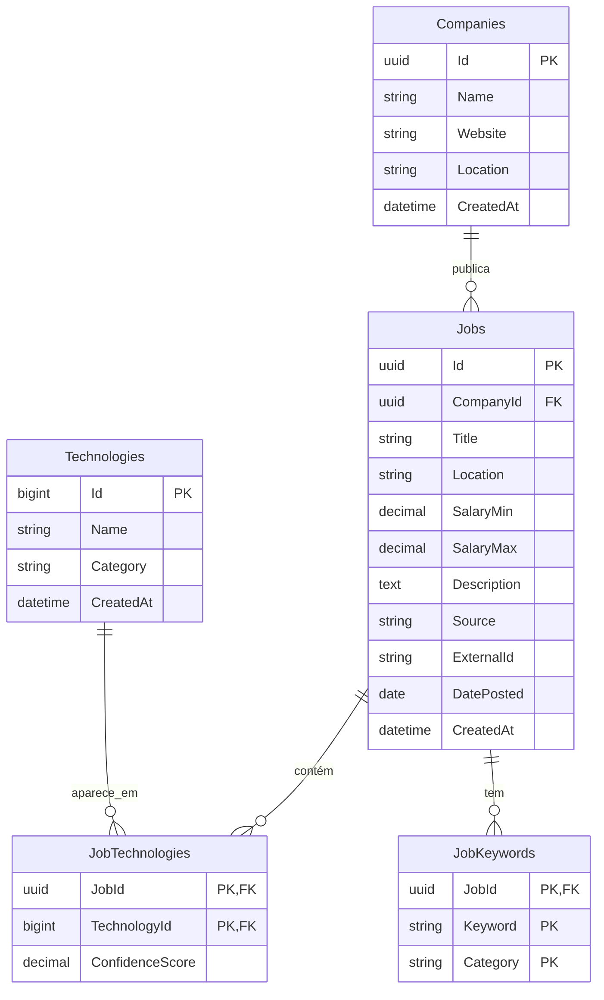

# Por que não temos autenticação

A aplicação **não tem login, registo nem qualquer sistema de autenticação**. Esta decisão foi tomada porque:

1. **Não há personalização por utilizador** — a app mostra dados agregados do mercado (total de anúncios, tecnologias mais procuradas, tendências). Não há filtros guardados, preferências ou dados privados.
2. **É uma aplicação pública de leitura** — todas as rotas são `GET`. Os scrapers é que escrevem na base de dados; a web app só lê.
4. **Demo pública simples** — qualquer pessoa pode entrar na app e ver o dashboard. Sem barreiras.

Isto também simplifica o deployment: não precisamos de HTTPS obrigatório por causa de cookies, nem de gestão de segredos de auth.

---

## Arquitetura da web app 

### Dashboard

- total de anúncios
- tecnologias mais procuradas
- gráfico de tendências do mercado
- distribuição regional
- volume de anúncios recentes
- pesquisa rápida de tecnologias que leva para a página de detalhe da tecnologia

### Página de detalhe da tecnologia

- nome da tecnologia
- número de anúncios
- tendência mensal
- salários
- tecnologias relacionadas
- empresas que recrutam
- anúncios recentes relacionados

### Página de anúncios

- barra de pesquisa para anúncios
- filtros
- cartões de anúncio por ordem, do mais recente para o mais antigo
- paginação
- opção de abrir o link original do anúncio

## Modelo da Base de Dados gerada na pipeline
A ligação ao PostgreSQL foi centralizada em `data-pipeline/database/postgres.py` para evitar repetir configuração nos scrapers.
Assim, a configuração fica num único sítio e é mais fácil de manter.



---

# Como evitamos empresas duplicadas

A tabela `companies` tem `UNIQUE(name)` porque o mesmo nome deve representar a mesma empresa ao longo da pipeline.
Antes de guardar um job, o script confirma se a empresa já existe e reutiliza o `company_id` dessa linha.
Se não existir, a empresa é criada primeiro.

# Fluxo para gravar uma empresa e um job

Primeiro o script garante que a empresa existe na tabela `companies`.
Se a empresa ainda não existir, ela é criada e o código recebe o `company_id` dessa linha.
Depois o script procura um job com a mesma combinação de `company_id`, `title` e `location`.
Se encontrar, não grava outro igual.
Se não encontrar, cria o job novo ligado à empresa certa.

Isto evita duplicados simples e mantém a relação entre empresas e anúncios limpa.

## Porque a tabela `jobs` não tem descrição nem salário

A tabela `Jobs` guarda apenas o essencial para identificação e análise:
- `Title`, `Location`, `Source`, `ExternalId`, `DatePosted`, `CreatedAt`

As colunas `SalaryMin`, `SalaryMax` e `Description` foram removidas porque:
1. **Descrição** — não a usamos diretamente na app; as keywords extraídas vivem na tabela `JobKeywords`
2. **Salário** — a extração é inconsistente entre fontes (LinkedIn vs Indeed) e não é o foco do projeto
3. **Simplicidade** — menos colunas = menos código, menos manutenção, menos coisas que podem quebrar quando os scrapers mudam

A tabela `companies` existe para normalizar empresas e evitar duplicados.
A tabela `jobs` guarda o anúncio principal para depois servir análises na app .NET.

`date_posted` fica como `DATE` e não `TIMESTAMPTZ`, porque nos scrapers o que normalmente vem do LinkedIn/Indeed é só a data do anúncio e não uma hora exata.
O `created_at` continua como `TIMESTAMPTZ` porque aí sim interessa saber o momento exacto em que o registo entrou na base de dados.


## Como ligamos jobs a tecnologias

Cada scraper tem duas variáveis importantes: `QUERY` e `TECHNOLOGY_NAME`.
`QUERY` é o termo usado no site para fazer a pesquisa.
`TECHNOLOGY_NAME` é o nome que guardamos na tabela `technologies`.

Por exemplo, se quisermos analisar `.NET`, podemos usar `QUERY=".net"` e `TECHNOLOGY_NAME=".NET"`.
Se o título ou a descrição mencionar claramente a tecnologia, o score vai para `1.0`.
Se a relação vier apenas do contexto da pesquisa, o score fica em `0.5`.

Isto permite filtrar depois: `confidence_score = 1.0` mostra apenas tecnologias confirmadas no anúncio; `confidence_score = 0.5` inclui também relações contextuais.

A tabela `technologies` usa um ID simples auto-incrementado porque facilita leitura e manutenção.
A relação final é guardada em `job_technologies` com `confidence_score`.

## Como funciona a paginação guardada

Para não começar sempre no `0`, a pipeline guarda o último `start` usado num ficheiro CSV local: `data-pipeline/scrapers/scraper_state.csv`.
Cada linha associa `source` + `query` ao último bloco percorrido.

Na execução seguinte, o scraper lê esse ficheiro e retoma a partir de `last_start + PAGE_SIZE`.
Se a `QUERY` mudar, a chave muda também e a paginação volta automaticamente a `0`.

Isto mantém a lógica simples e evita repetir sempre as mesmas páginas quando o script é corrido várias vezes seguidas.

# Como reduzimos rate limiting e verificações

   ## LinkedIn

   No LinkedIn tentamos reduzir bloqueios sem forçar demasiado o site:

   - usamos `headers` mais completos, em vez de um pedido mínimo
   - incluímos `User-Agent`, `Accept`, `Accept-Language` e `Referer`
   - fazemos uma pausa aleatória antes de cada pedido
   - evitamos correr muitas páginas seguidas sem necessidade

   ## Indeed

   No Indeed o problema é mais agressivo, porque pode surgir verificação logo no início.

   Para reduzir isso:

   - abrimos o browser de forma visível (`headless=False`)
   - usamos um perfil persistente para reutilizar cookies e sessão
   - ligamos ao Chrome real via `remote debugging`
   - mantemos pausas aleatórias entre acções
   - não insistimos quando aparece verificação; o scraper deve parar e deixar o utilizador intervir

   O uso do perfil persistente e do Chrome real ajuda porque o site vê um ambiente mais estável, com histórico e sessão reutilizável, em vez de uma instância nova a cada execução.

O scraper do Indeed pode ligar-se a um Chrome real via `remote debugging` para reutilizar cookies e sessão do teu PC.
Para isso existe o ficheiro `start_chrome_debug.bat`, que abre o Chrome com a porta `9222` activa.

O perfil usado por esse browser fica em `data-pipeline/scrapers/chrome-profile/` e é criado automaticamente quando corres o Chrome desse modo ou quando o scraper o usa pela primeira vez.


## Links base para testar

Indeed:
`https://pt.indeed.com/jobs?q=python&l=Porto&radius=50&start=0`

LinkedIn:
`https://www.linkedin.com/jobs-guest/jobs/api/seeMoreJobPostings/search?keywords=javascript&location=Portugal&start=120`

## Filtros úteis

| Filtro           | LinkedIn / Google Jobs | Indeed            |
|------------------|------------------------|-------------------|
| Últimas 24h      | `f_TPR=r86400`         | `fromage=1`       |
| Última semana    | `f_TPR=r604800`        | `fromage=7`       |
| Full-time        | `f_JT=F`               | `jt=fulltime`     |
| Remote           | `f_WT=2`               | `remotejob=1`     |
| Júnior / Entry   | `f_E=2`                | `explvl=entry_level` |


## Por que mudámos para PascalCase

O schema original usava `snake_case` (`id`, `created_at`, `company_id`). Mudámos tudo para **PascalCase** (`"Id"`, `"CreatedAt"`, `"CompanyId"`) por três razões:

1. **Alinhamento com o .NET** – as propriedades das entidades no C# seguem PascalCase (`Id`, `CreatedAt`, `CompanyId`). Manter os mesmos nomes no PostgreSQL evita mapeamentos manuais ou atributos `[Column("created_at")]` em todo o lado.
2. **Consistência interna** – ao usar aspas duplas nas definições SQL (`"Id"`, `"CreatedAt"`), o PostgreSQL preserva a capitalização exacta, tornando o schema auto-documentado e igual ao modelo de domínio.
3. **Menos atrito em ferramentas** – ORMs (EF Core, Dapper com mapeamento automático) funcionam *out-of-the-box* quando os nomes coincidem.

---

# Feature: JobKeywords

A tabela `JobKeywords` guarda keywords extraídas das descrições dos anúncios: seniority, anos de experiência, modelo de trabalho e tecnologias complementares.

## Por que uma tabela separada?

Em vez de guardar a descrição completa na tabela `Jobs`, optámos por extrair apenas as keywords relevantes e guardá-las numa tabela pivot. Razões:

1. **Espaço** — descrições completas ocupam muito mais espaço e não são necessárias para análise agregada.
2. **Performance** — queries sobre centenas de milhares de descrições completas são lentas; sobre keywords normalizadas são rápidas.
3. **Privacidade** — não armazenamos conteúdo sensível dos anúncios (nomes de pessoas, detalhes de contacto, etc.).
4. **Simplicidade** — o motor de análise funciona com contagens de keywords, não com texto livre.

## Categorias de keywords

| Categoria | Exemplos |
|---|---|
| `seniority` | junior, pleno, senior, lead |
| `experience` | 1+ anos, 2-3 anos, 5+ anos |
| `work_model` | remoto, híbrido, presencial |
| `technology` | react, docker, postgresql, typescript |

## Como funciona a extração

Usamos **regex simples** em vez de NLP ou machine learning porque:

1. **Determinístico** — o mesmo texto sempre produz o mesmo resultado.
2. **Leve** — não requer dependências externas pesadas.
3. **Transparente** — fácil de depurar e ajustar.
4. **Suficiente** — para padrões como "junior", "5+ anos", "remote", regex funciona bem.

Procuramos por tecnologias na descrição para que possamos ter a capacidade de encontrar padrões e tecnologias relacionadas.


## Scrapers de keywords

São dois scripts separados que percorrem a base de dados e extraem keywords:

```
indeed_keywords.py      → processa jobs do Indeed
linkedin_keywords.py    → processa jobs do LinkedIn
```

Ambos partilham a mesma lógica:

1. **Descoberta** — query `SELECT ... WHERE Source = %s AND Id NOT IN (SELECT JobId FROM JobKeywords) LIMIT 50`.
   Isto garante que só processa jobs que ainda não têm keywords, sem necessidade de estado ou ficheiros CSV.
2. **Extração** — abre a página do anúncio, extrai a descrição, aplica regex.
3. **Persistência** — guarda as keywords encontradas na tabela `JobKeywords`.

## Por que o LinkedIn usa Playwright

O LinkedIn carrega a descrição do anúncio via **JavaScript**. Quando acedemos à página com `requests + BeautifulSoup`, recebemos apenas o HTML inicial, que não contém a descrição.

Para contornar isto, o `linkedin_keywords.py` usa **Playwright via CDP** (igual ao scraper do Indeed).
Isto significa que o Chrome debug (`start_chrome_debug.bat`) tem de estar aberto quando correres os scrapers de keywords do LinkedIn. O Indeed não tem este problema porque o scraper original já usava Playwright. Mantivemos a consistência.

## Execução

```bash
# 1. Aplica a migration (uma única vez)
psql -U postgres -d techscope -f data-pipeline/database/migrations/001_initial.sql

# 2. Corre os scrapers de keywords (batch de 50 por execução)
python data-pipeline/scrapers/indeed_keywords.py
python data-pipeline/scrapers/linkedin_keywords.py

# 3. Quando não houver mais jobs, a query retorna vazio
```

Cada execução processa até 50 jobs por source. Corre os scripts várias vezes até esgotarem os jobs sem keywords.

