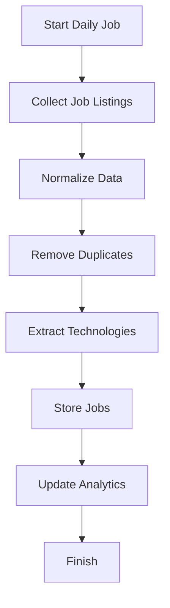
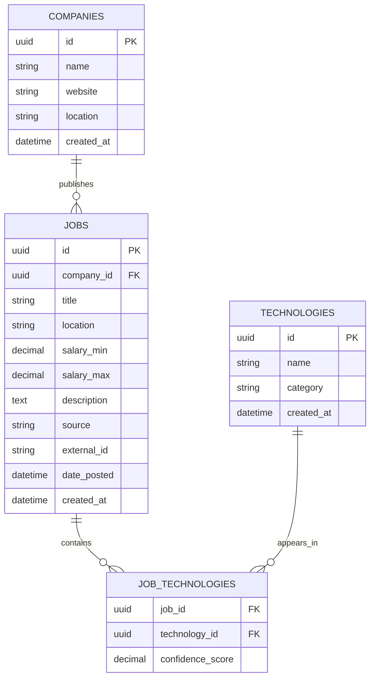

<div align="center">
# TechScope

TechScope is a tech market analysis platform that evaluates the demand for programming languages, frameworks, and tools based on real job market data.

The system collects job postings from multiple sources, analyses the technologies mentioned, and provides insights about:
- Technology demand
- Market growth trends
- Technology comparisons
- Salary information (when available)
- Related technologies

The goal is to help developers make informed decisions about what technologies are worth learning.

  

</div>

---

# Architecture

TechScope follows a data ingestion and analytics architecture.

The system is divided into three main components:

- **Python Data Pipeline**
  - Crawling job sources
  - Data processing
  - Technology extraction
  - Data normalization

- **PostgreSQL Database**
  - Stores jobs
  - Stores companies
  - Stores technologies
  - Stores relationships between jobs and technologies

- **.NET API**
  - Provides data access
  - Handles business logic
  - Exposes analytics endpoints

## System Architecture

```mermaid
flowchart LR

    Sources[(Job Sources)]

    subgraph Python Pipeline
        Scheduler[Daily Scheduler]
        Scrapers[Job Scrapers]
        Processor[Data Processing]
        NLP[Technology Extraction]
    end

    DB[(PostgreSQL)]

    subgraph .NET Application
        API[ASP.NET Core API]
        Analytics[Analytics Engine]
    end

    Frontend[Web Dashboard]

    Sources --> Scheduler
    Scheduler --> Scrapers
    Scrapers --> Processor
    Processor --> NLP
    NLP --> DB

    DB --> API
    API --> Analytics
    Analytics --> Frontend
````

---

# Data Pipeline

The ingestion process runs as a scheduled background job.

Example:

```
02:00 - Scheduler starts
02:05 - Scrapers collect new jobs
02:15 - Data normalization
02:20 - Technology extraction
02:30 - Database update
```

## Pipeline Flow



# Database Model

Main entities:

* Jobs
* Companies
* Technologies
* JobTechnologies

## Entity Relationship Diagram



---

# Database Rules

## Job Deduplication

Jobs must not be duplicated.

Identification strategy:

Priority:

1. External job ID from source
2. Generated hash:

```
title + company + location + date_posted
```

---

## Technology Detection

Example:

Input:

```
Backend Developer

Required:
Java
Spring Boot
Docker
PostgreSQL
```

Processing result:

```
Job
 |
 +-- Java
 |
 +-- Spring Boot
 |
 +-- Docker
 |
 +-- PostgreSQL
```

---

# Main Features

## Technology Analysis

Search for technologies:

Examples:
* Java
* React
* Node.js
* Docker
* Kubernetes

Returns:
* Number of available jobs
* Market share
* Growth over time
* Related technologies

---

## Technology Comparison

Example:

```
Spring Boot vs Node.js
```

Comparison:

| Metric         | Spring Boot | Node.js |
| -------------- | ----------- | ------- |
| Job Count      |             |         |
| Growth         |             |         |
| Salary Average |             |         |
| Related Skills |             |         |

---

## Market Trends

Identifies technologies with increasing demand.

Example:

```
Technology     Growth

Kubernetes     +35%
Docker         +28%
React          +15%
```

---

# Project Structure

```
TechScope/

├── backend/
│   ├── TechScope.API/
│   ├── TechScope.Application/
│   ├── TechScope.Domain/
│   └── TechScope.Infrastructure/

├── data-pipeline/
│   ├── scrapers/
│   ├── processors/
│   ├── analyzers/
│   └── database/

├── database/
│   └── migrations/

└── README.md
```

---

# Future Improvements

* Real-time dashboards
* Machine learning based technology extraction
* Salary prediction
* Regional market analysis
* Job recommendation engine
* Historical market forecasting

---
