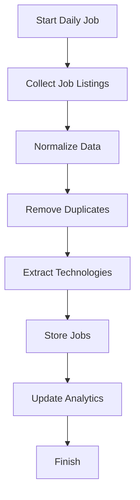

<div align="center">
  
# TechScope

 

TechScope is a technology market analysis web app that evaluates the demand for programming languages, frameworks, and tools based on real-world job market data. 

</div>

The system collects job postings from multiple sources, analyses the technologies mentioned in each listing, and transforms this information into valuable insights about the current technology landscape. The platform provides information about technology demand, market growth trends, technology comparisons, salary information when available, and relationships between technologies that are commonly used together.
The goal of TechScope is to help developers make more informed decisions about which technologies are worth learning, allowing them to better understand market requirements and identify professional growth opportunities.

# Architecture

TechScope follows a data ingestion and analytics architecture.

The system is divided into three main components:

- **Python Data Pipeline**
  - Crawling job sources
  - Data processing
  - Technology extraction
  - Data normalization

- **PostgreSQL Database**
  - Stores jobs
  - Stores companies
  - Stores technologies
  - Stores relationships between jobs and technologies

- **.NET API**
  - Provides data access
  - Handles business logic
  - Exposes analytics endpoints

## System Architecture

```mermaid
flowchart LR

    Sources[(Job Sources)]

    subgraph Python Pipeline
        Scheduler[Daily Scheduler]
        Scrapers[Job Scrapers]
        Processor[Data Processing]
        NLP[Technology Extraction]
    end

    DB[(PostgreSQL)]

    subgraph .NET Application
        API[ASP.NET Core API]
        Analytics[Analytics Engine]
    end

    Frontend[Web Dashboard]

    Sources --> Scheduler
    Scheduler --> Scrapers
    Scrapers --> Processor
    Processor --> NLP
    NLP --> DB

    DB --> API
    API --> Analytics
    Analytics --> Frontend
````

---

# Data Pipeline

The ingestion process runs as a scheduled background job.

Example:

```
02:00 - Scheduler starts
02:05 - Scrapers collect new jobs
02:15 - Data normalization
02:20 - Technology extraction
02:30 - Database update
```

## Pipeline Flow


```mermaid
flowchart TD

    A[Start Daily Job]

    B[Collect Job Listings]

    C[Normalize Data]

    D[Remove Duplicates]

    E[Extract Technologies]

    F[Store Jobs]

    G[Update Analytics]

    H[Finish]

    A --> B
    B --> C
    C --> D
    D --> E
    E --> F
    F --> G
    G --> H
```

# Database Model


```mermaid
erDiagram

    COMPANIES ||--o{ JOBS : publishes

    JOBS ||--o{ JOB_TECHNOLOGIES : contains

    TECHNOLOGIES ||--o{ JOB_TECHNOLOGIES : appears_in


    COMPANIES {
        uuid id PK
        string name
        string website
        string location
        datetime created_at
    }


    JOBS {
        uuid id PK
        uuid company_id FK
        string title
        string location
        decimal salary_min
        decimal salary_max
        text description
        string source
        string external_id
        datetime date_posted
        datetime created_at
    }


    TECHNOLOGIES {
        uuid id PK
        string name
        string category
        datetime created_at
    }


    JOB_TECHNOLOGIES {
        uuid job_id FK
        uuid technology_id FK
        decimal confidence_score
    }
```

---

# PostgreSQL Setup

Create a `.env` file in the project root. You can copy from `.env.example`:

```bash
copy .env.example .env
```

The Python scrapers read the following variables from `.env`:

- `DATABASE_URL`
- `PGHOST`
- `PGPORT`
- `PGDATABASE`
- `PGUSER`
- `PGPASSWORD`

On first run, the scrapers create the base schema from `data-pipeline/database/migrations/001_initial.sql`.

Run the scrapers from the repository root:

```bash
python data-pipeline/scrapers/indeed.py
python data-pipeline/scrapers/linkedin.py
```

---

# Database Rules

## Job Deduplication

To keep the database clean, each job posting should be stored only once.

The system first tries to identify a job using the unique identifier provided by the source itself. When the source exposes a stable external job ID, that value is used as the primary deduplication key because it is the most reliable way to recognise the same posting again in a later crawl.

If the source does not provide a usable external ID, the system falls back to a generated fingerprint built from the most relevant job fields, such as title, company, location, and posting date. This gives the pipeline a consistent way to detect repeated records even when the source data is incomplete.

In practice, the deduplication flow works like this:

1. Check whether the job has an external ID from the source.
2. If it does, use that ID to decide whether the job already exists.
3. If it does not, generate a deterministic hash from the job details.
4. Use that hash as the fallback identifier for deduplication.

This approach reduces duplicates while still allowing the scraper to work with sources that expose different levels of metadata.

---

## Technology Detection

After jobs are stored, the pipeline analyses the job description and the surrounding text to identify technologies mentioned in the listing.

The goal is to understand which tools, languages, and frameworks are associated with a given job. For example, a backend developer role might mention Java, Spring Boot, Docker, and PostgreSQL. The processor reads those mentions and turns them into structured data that can later be queried for analytics.

This extraction step is important because it allows the platform to answer questions such as:

* Which technologies are most in demand?
* Which technologies appear together most often?
* How does demand change over time?
* Which skills are commonly requested for a specific role or market segment?

The resulting structured representation links each job to one or more technologies, making it possible to build comparisons, trend charts, and market insights on top of the raw job data.

---

# Main Features

## Technology Analysis

Search for technologies:

Examples:
* Java
* React
* Node.js
* Docker
* Kubernetes

Returns:
* Number of available jobs
* Market share
* Growth over time
* Related technologies

---

## Technology Comparison

Example:

```
Spring Boot vs Node.js
```

Comparison:

| Metric         | Spring Boot | Node.js |
| -------------- | ----------- | ------- |
| Job Count      |             |         |
| Growth         |             |         |
| Salary Average |             |         |
| Related Skills |             |         |

---

## Market Trends

Identifies technologies with increasing demand.

Example:

```
Technology     Growth

Kubernetes     +35%
Docker         +28%
React          +15%
```

---

# Project Structure

```
TechScope/

├── backend/
│   └── TechScope.Mvc/
│
├── data-pipeline/
│   ├── scrapers/
│   │   ├── indeed.py
│   │   └── linkedin.py
│   ├── processors/
│   ├── analyzers/
│   └── database/
│       └── migrations/
│
├── .env
├── .env.example
├── .gitignore
└── README.md
```

---

# Future Improvements

* Real-time dashboards
* Machine learning based technology extraction
* Salary prediction
* Regional market analysis
* Job recommendation engine
* Historical market forecasting

---
