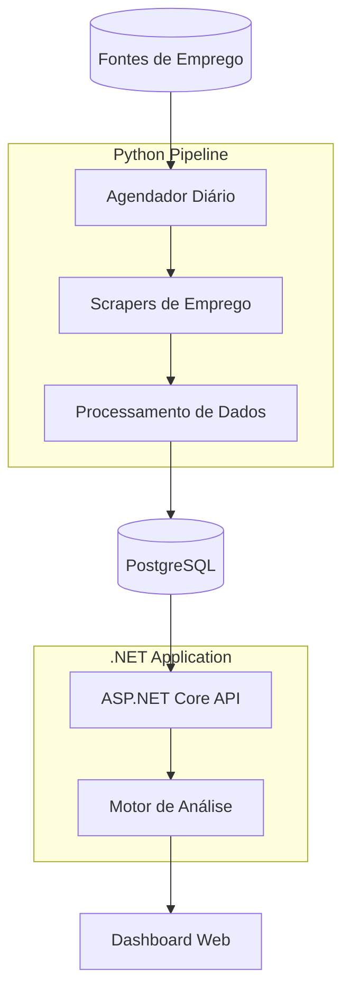

<div align="center">
  
# TechScope


O TechScope é uma aplicação web de análise do mercado tecnológico que avalia a procura por linguagens de programação, frameworks e ferramentas com base em dados reais de anúncios de emprego.

  
</div>


## Sobre o projeto

O sistema recolhe ofertas de emprego do Linkedin e do Indeed, analisa cada anúncio e transforma essa informação em insights úteis sobre o mercado tech atual. 
A app fornece informação sobre procura de tecnologias, tendências de crescimento do mercado, comparações entre tecnologias, informação salarial quando disponível e relações entre tecnologias que costumam ser usadas em conjunto.
O objectivo da TechScope é ajudar devs a melhor compreenderem os requisitos do mercado e identificarem oportunidades de crescimento profissional.

# Arquitetura

O sistema está dividido em três componentes principais:


```mermaid
flowchart TD

    Sources[(Fontes de Emprego)]

    subgraph PythonPipeline[Python Pipeline]
        Scheduler[Agendador Diário]
        Scrapers[Scrapers de Emprego]
        Processor[Processamento de Dados]
    end

    DB[(PostgreSQL)]

    subgraph NETApp[.NET Application]
        API[ASP.NET Core API]
        Analytics[Motor de Análise]
    end

    Frontend[Dashboard Web]

    Sources --> Scheduler
    Scheduler --> Scrapers
    Scrapers --> Processor
    Processor --> DB


    DB --> API
    API --> Analytics
    Analytics --> Frontend
```

## Funcionalidades Principais

### Análise de Tecnologias

Pesquisa por tecnologias:

Exemplos:
* Java
* React
* Node.js
* Docker
* Kubernetes

Devolve:
* Número de anúncios disponíveis
* Quota de mercado
* Crescimento ao longo do tempo


### Comparação de Tecnologias

Exemplo de Comparação:

| Métrica | Spring Boot | Node.js |
| --- | --- | --- |
| Número de anúncios | 1000 | 250 |
| Crescimento | +10% | -2% |
| Competências relacionadas |  |  |


### Tendências de Mercado

Identifica tecnologias com procura crescente.

Exemplo:

```
Tecnologia     Crescimento

Kubernetes     +35%
Docker         +28%
React          +15%
```


## Começando com o projeto

### 1. Pré-requisitos

- Python 3.11+
- PostgreSQL
- Google Chrome instalado (para o scraper do Indeed)

### 2. Criar e activar o ambiente virtual

Na raiz do projecto:

```bash
python -m venv .venv
.venv\Scripts\activate
```

### 3. Instalar dependências

```bash
pip install -r requirements.txt
```

### 4. Configurar variáveis de ambiente

Cria um ficheiro `.env` na raiz do projecto. Podes copiar a partir de `.env.example`:

```bash
copy .env.example .env
```

Os scrapers em Python lêem as seguintes variáveis do `.env`:

- `DATABASE_URL`
- `PGHOST`
- `PGPORT`
- `PGDATABASE`
- `PGUSER`
- `PGPASSWORD`

### 5. Arrancar o Chrome para o Indeed

Para o scraper do Indeed, corre o ficheiro:

```bash
start_chrome_debug.bat
```

Isto abre o Chrome com o perfil do projecto e a porta de debug activa.

### 6. Correr os scrapers

Na primeira execução, os scrapers criam o schema base a partir de `data-pipeline/database/migrations/001_initial.sql`.

Executa os scrapers a partir da raiz do repositório:

```bash
python data-pipeline/scrapers/indeed.py
python data-pipeline/scrapers/linkedin.py
```


## Roadmap

- [x] Scrapers para linkedin e indeed
- [x] Estrutura inicial da base de dados
- [x] Persistência em PostgreSQL

### Análise do Mercado

* [ ] Pesquisa e análise individual de tecnologias
* [ ] Contagem de anúncios por tecnologia
* [ ] Cálculo da quota de mercado de cada tecnologia
* [ ] Análise do crescimento da procura ao longo do tempo
* [ ] Identificação automática de tendências de mercado
* [ ] Comparação entre tecnologias
* [ ] Identificação de relações entre tecnologias frequentemente utilizadas em conjunto
* [ ] Recolha e apresentação de informação salarial quando disponível

### Aplicação Web

* [ ] Frontend web
* [ ] Dashboard de análise do mercado
* [ ] Pesquisa e filtragem de tecnologias

### Análise Regional

* [ ] Análise regional do mercado tecnológico
* [ ] Comparação da procura por tecnologia entre regiões

