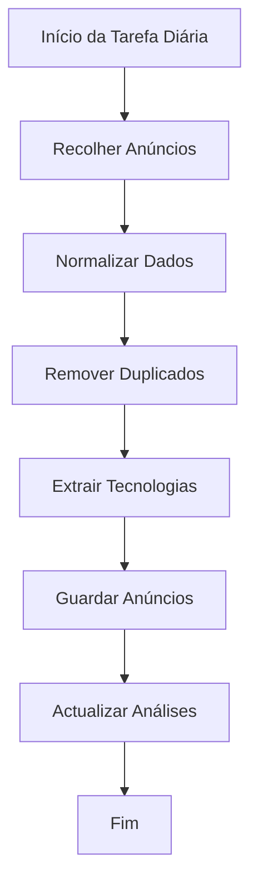

<div align="center">
  
# TechScope

 

O TechScope é uma aplicação web de análise do mercado tecnológico que avalia a procura por linguagens de programação, frameworks e ferramentas com base em dados reais de anúncios de emprego.

</div>

O sistema recolhe ofertas de emprego de várias fontes, analisa as tecnologias mencionadas em cada anúncio e transforma essa informação em insights úteis sobre o panorama tecnológico actual. A plataforma fornece informação sobre procura de tecnologias, tendências de crescimento do mercado, comparações entre tecnologias, informação salarial quando disponível e relações entre tecnologias que costumam ser usadas em conjunto.
O objectivo do TechScope é ajudar developers a tomar decisões mais informadas sobre que tecnologias vale a pena aprender, para melhor compreenderem os requisitos do mercado e identificarem oportunidades de crescimento profissional.

# Arquitectura

O TechScope segue uma arquitectura de ingestão e análise de dados.

O sistema está dividido em três componentes principais:

- **Pipeline de Dados em Python**
  - Recolha de anúncios de emprego
  - Processamento de dados
  - Extração de tecnologias
  - Normalização de dados

- **Base de Dados PostgreSQL**
  - Guarda anúncios de emprego
  - Guarda empresas
  - Guarda tecnologias
  - Guarda relações entre anúncios e tecnologias

- **API .NET**
  - Fornece acesso aos dados
  - Trata da lógica de negócio
  - Expõe endpoints de análise

## Arquitectura do Sistema

```mermaid
flowchart LR

    Sources[(Fontes de Emprego)]

    subgraph Python Pipeline
        Scheduler[Agendador Diário]
        Scrapers[Scrapers de Emprego]
        Processor[Processamento de Dados]
        NLP[Extração de Tecnologias]
    end

    DB[(PostgreSQL)]

    subgraph .NET Application
        API[ASP.NET Core API]
        Analytics[Motor de Análise]
    end

    Frontend[Dashboard Web]

    Sources --> Scheduler
    Scheduler --> Scrapers
    Scrapers --> Processor
    Processor --> NLP
    NLP --> DB

    DB --> API
    API --> Analytics
    Analytics --> Frontend
````

---

# Pipeline de Dados

O processo de ingestão corre como uma tarefa agendada em background.

Exemplo:

```
02:00 - O agendador inicia
02:05 - Os scrapers recolhem novos anúncios
02:15 - Normalização de dados
02:20 - Extração de tecnologias
02:30 - Actualização da base de dados
```

## Fluxo da Pipeline


```mermaid
flowchart TD

    A[Início da Tarefa Diária]

    B[Recolher Anúncios]

    C[Normalizar Dados]

    D[Remover Duplicados]

    E[Extrair Tecnologias]

    F[Guardar Anúncios]

    G[Actualizar Análises]

    H[Fim]

    A --> B
    B --> C
    C --> D
    D --> E
    E --> F
    F --> G
    G --> H
```

# Modelo da Base de Dados


```mermaid
erDiagram

    COMPANIES ||--o{ JOBS : publica

    JOBS ||--o{ JOB_TECHNOLOGIES : contém

    TECHNOLOGIES ||--o{ JOB_TECHNOLOGIES : aparece_em


    COMPANIES {
        uuid id PK
        string name
        string website
        string location
        datetime created_at
    }


    JOBS {
        uuid id PK
        uuid company_id FK
        string title
        string location
        decimal salary_min
        decimal salary_max
        text description
        string source
        string external_id
        date date_posted
        datetime created_at
    }


    TECHNOLOGIES {
        uuid id PK
        string name
        string category
        datetime created_at
    }


    JOB_TECHNOLOGIES {
        uuid job_id FK
        uuid technology_id FK
        decimal confidence_score
    }
```

---

# Configuração do PostgreSQL

Cria um ficheiro `.env` na raiz do projecto. Podes copiar a partir de `.env.example`:

```bash
copy .env.example .env
```

Os scrapers em Python lêem as seguintes variáveis do `.env`:

- `DATABASE_URL`
- `PGHOST`
- `PGPORT`
- `PGDATABASE`
- `PGUSER`
- `PGPASSWORD`

Na primeira execução, os scrapers criam o schema base a partir de `data-pipeline/database/migrations/001_initial.sql`.

Executa os scrapers a partir da raiz do repositório:

```bash
python data-pipeline/scrapers/indeed.py
python data-pipeline/scrapers/linkedin.py
```

---

# Regras da Base de Dados

## Deduplicação de Anúncios

Para manter a base de dados limpa, cada anúncio deve ser guardado apenas uma vez.

O sistema primeiro tenta identificar um anúncio usando o identificador único fornecido pela própria fonte. Quando a fonte expõe um ID externo estável, esse valor é usado como chave principal de deduplicação, porque é a forma mais fiável de reconhecer o mesmo anúncio numa recolha futura.

Se a fonte não fornecer um ID externo utilizável, o sistema recorre a uma assinatura gerada a partir dos campos mais relevantes do anúncio, como título, empresa, localização e data da publicação. Isto dá à pipeline uma forma consistente de detectar registos repetidos mesmo quando os dados da fonte são incompletos.

Na prática, o fluxo de deduplicação funciona assim:

1. Verifica se o anúncio tem um ID externo da fonte.
2. Se tiver, usa esse ID para decidir se o anúncio já existe.
3. Se não tiver, gera um hash determinístico a partir dos detalhes do anúncio.
4. Usa esse hash como identificador de recurso para deduplicação.

Esta abordagem reduz duplicados e continua a permitir que o scraper trabalhe com fontes que expõem níveis diferentes de metadados.

---

## Detecção de Tecnologias

Depois de os anúncios serem guardados, a pipeline analisa a descrição do anúncio e o texto envolvente para identificar tecnologias mencionadas na oferta.

O objectivo é perceber que ferramentas, linguagens e frameworks estão associadas a cada anúncio. Por exemplo, uma vaga de backend pode referir Java, Spring Boot, Docker e PostgreSQL. O processador lê essas menções e transforma-as em dados estruturados que depois podem ser consultados para análises.

Esta etapa é importante porque permite à plataforma responder a perguntas como:

* Quais são as tecnologias mais procuradas?
* Que tecnologias aparecem mais vezes em conjunto?
* Como evolui a procura ao longo do tempo?
* Que competências são mais pedidas para um cargo ou segmento de mercado específico?

A representação estruturada resultante liga cada anúncio a uma ou mais tecnologias, o que permite construir comparações, gráficos de tendência e insights de mercado em cima dos dados brutos.

---

# Funcionalidades Principais

## Análise de Tecnologias

Pesquisa por tecnologias:

Exemplos:
* Java
* React
* Node.js
* Docker
* Kubernetes

Devolve:
* Número de anúncios disponíveis
* Quota de mercado
* Crescimento ao longo do tempo
* Tecnologias relacionadas

---

## Comparação de Tecnologias

Exemplo:

```
Spring Boot vs Node.js
```

Comparação:

| Métrica        | Spring Boot | Node.js |
| -------------- | ----------- | ------- |
| Número de anúncios |         |         |
| Crescimento    |             |         |
| Salário médio  |             |         |
| Competências relacionadas |   |         |

---

## Tendências de Mercado

Identifica tecnologias com procura crescente.

Exemplo:

```
Tecnologia     Crescimento

Kubernetes     +35%
Docker         +28%
React          +15%
```

---

# Estrutura do Projecto

```
TechScope/

├── backend/
│   └── TechScope.Mvc/
│
├── data-pipeline/
│   ├── scrapers/
│   │   ├── indeed.py
│   │   └── linkedin.py
│   ├── processors/
│   ├── analyzers/
│   └── database/
│       └── migrations/
│
├── .env
├── .env.example
├── .gitignore
└── README.md
```

---

# Melhorias Futuras

* Dashboards em tempo real
* Extração de tecnologias com machine learning
* Previsão salarial
* Análise regional do mercado
* Motor de recomendação de empregos
* Previsão histórica do mercado

---