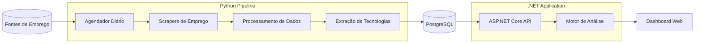
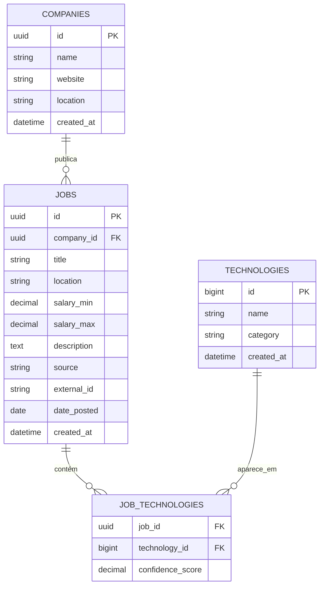

<div align="center">
  
# TechScope


O TechScope é uma aplicação web de análise do mercado tecnológico que avalia a procura por linguagens de programação, frameworks e ferramentas com base em dados reais de anúncios de emprego.

 
</div>

O sistema recolhe ofertas de emprego de várias fontes, analisa as tecnologias mencionadas em cada anúncio e transforma essa informação em insights úteis sobre o panorama tecnológico actual. A plataforma fornece informação sobre procura de tecnologias, tendências de crescimento do mercado, comparações entre tecnologias, informação salarial quando disponível e relações entre tecnologias que costumam ser usadas em conjunto.
O objectivo do TechScope é ajudar developers a tomar decisões mais informadas sobre que tecnologias vale a pena aprender, para melhor compreenderem os requisitos do mercado e identificarem oportunidades de crescimento profissional.

# Arquitectura

O TechScope segue uma arquitectura de ingestão e análise de dados.

O sistema está dividido em três componentes principais:

- **Pipeline de Dados em Python**
  - Recolha de anúncios de emprego
  - Processamento de dados
  - Extração de tecnologias
  - Normalização de dados

- **Base de Dados PostgreSQL**
  - Guarda anúncios de emprego
  - Guarda empresas
  - Guarda tecnologias
  - Guarda relações entre anúncios e tecnologias

- **API .NET**
  - Fornece acesso aos dados
  - Trata da lógica de negócio
  - Expõe endpoints de análise

## Arquitectura do Sistema


```mermaid
flowchart LR

    Sources[(Fontes de Emprego)]

    subgraph PythonPipeline[Python Pipeline]
        Scheduler[Agendador Diário]
        Scrapers[Scrapers de Emprego]
        Processor[Processamento de Dados]
        NLP[Extração de Tecnologias]
    end

    DB[(PostgreSQL)]

    subgraph NETApp[.NET Application]
        API[ASP.NET Core API]
        Analytics[Motor de Análise]
    end

    Frontend[Dashboard Web]

    Sources --> Scheduler
    Scheduler --> Scrapers
    Scrapers --> Processor
    Processor --> NLP
    NLP --> DB

    DB --> API
    API --> Analytics
    Analytics --> Frontend
```

# Modelo da Base de Dados


```mermaid
erDiagram

    COMPANIES ||--o{ JOBS : publica

    JOBS ||--o{ JOB_TECHNOLOGIES : contém

    TECHNOLOGIES ||--o{ JOB_TECHNOLOGIES : aparece_em


    COMPANIES {
        uuid id PK
        string name
        string website
        string location
        datetime created_at
    }


    JOBS {
        uuid id PK
        uuid company_id FK
        string title
        string location
        decimal salary_min
        decimal salary_max
        text description
        string source
        string external_id
        date date_posted
        datetime created_at
    }


    TECHNOLOGIES {
        bigint id PK
        string name
        string category
        datetime created_at
    }


    JOB_TECHNOLOGIES {
        uuid job_id FK
        bigint technology_id FK
        decimal confidence_score
    }
```

---

# Configuração do PostgreSQL

Cria um ficheiro `.env` na raiz do projecto. Podes copiar a partir de `.env.example`:

```bash
copy .env.example .env
```

Os scrapers em Python lêem as seguintes variáveis do `.env`:

- `DATABASE_URL`
- `PGHOST`
- `PGPORT`
- `PGDATABASE`
- `PGUSER`
- `PGPASSWORD`

Na primeira execução, os scrapers criam o schema base a partir de `data-pipeline/database/migrations/001_initial.sql`.

Executa os scrapers a partir da raiz do repositório:

```bash
python data-pipeline/scrapers/indeed.py
python data-pipeline/scrapers/linkedin.py
```

---

# Regras da Base de Dados

## Deduplicação de Anúncios

Para manter a base de dados limpa, cada anúncio deve ser guardado apenas uma vez para a mesma empresa, título e localização.

Na implementação actual, a deduplicação é feita na tabela `jobs` com base em:

- `company_id`
- `title`
- `location`

Primeiro o scraper garante que a empresa existe em `companies`. Depois procura um job com a mesma combinação de empresa, título e localização. Se encontrar, não cria outro registo igual.

O `external_id` continua a ser guardado para preservar a origem do anúncio, mas já não é a chave principal de deduplicação. Isto evita depender de URLs ou IDs de fonte que podem mudar entre execuções.

Na prática, o fluxo funciona assim:

1. Garante que a empresa existe em `companies`.
2. Procura um job com o mesmo `company_id`, `title` e `location`.
3. Se já existir, ignora a inserção do job.
4. Se não existir, cria o job novo e liga-o à empresa.

Esta abordagem é simples e robusta para os dados que estamos a recolher.

---

## Detecção de Tecnologias

Depois de um anúncio ser guardado, a pipeline liga-o a uma tecnologia na tabela `technologies` e regista a relação em `job_technologies`.

Cada scraper trabalha com duas variáveis:

- `QUERY`: o termo usado na pesquisa do site
- `TECHNOLOGY_NAME`: o nome canónico guardado na base de dados

A tecnologia é guardada numa tabela própria para evitar duplicação de nomes e a relação final fica na tabela pivot `job_technologies` com `confidence_score`.

O score serve para indicar o quão forte é a ligação entre o anúncio e a tecnologia:

- `1.0` quando a tecnologia aparece explicitamente no título ou descrição
- `0.9` quando a query é exactamente a tecnologia pesquisada
- `0.7` quando a relação vem apenas do contexto da pesquisa

Isto permite perceber que tecnologias estão associadas a cada anúncio e também quanta confiança temos nessa associação.

---

# Funcionalidades Principais

## Análise de Tecnologias

Pesquisa por tecnologias:

Exemplos:
* Java
* React
* Node.js
* Docker
* Kubernetes

Devolve:
* Número de anúncios disponíveis
* Quota de mercado
* Crescimento ao longo do tempo

---

## Comparação de Tecnologias

Exemplo de Comparação:

| Métrica | Spring Boot | Node.js |
| --- | --- | --- |
| Número de anúncios | 1000 | 250 |
| Crescimento | +10% | -2% |
| Salário médio |  |  |
| Competências relacionadas |  |  |

---

## Tendências de Mercado

Identifica tecnologias com procura crescente.

Exemplo:

```
Tecnologia     Crescimento

Kubernetes     +35%
Docker         +28%
React          +15%
```


# Melhorias Futuras

* Dashboards em tempo real
* Extração de tecnologias com machine learning
* Previsão salarial
* Análise regional do mercado
* Motor de recomendação de empregos
* Previsão histórica do mercado
